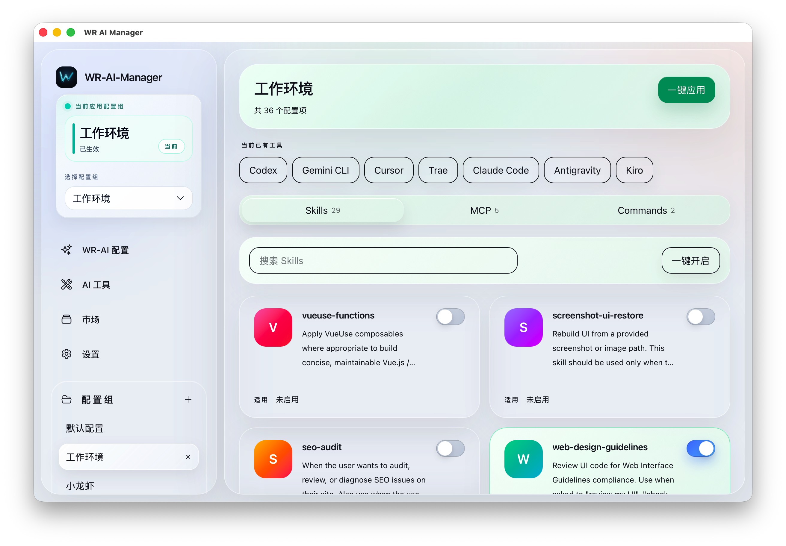
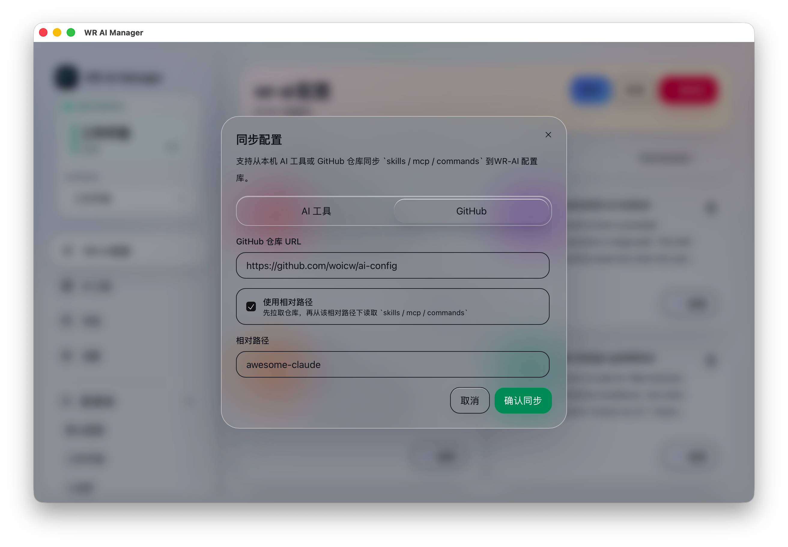
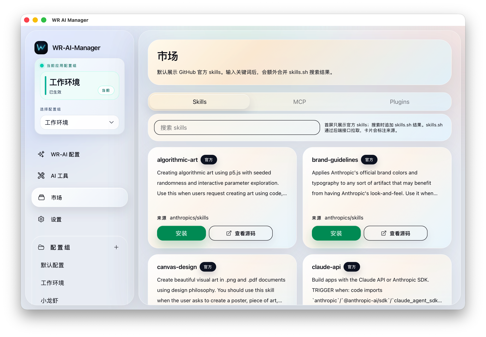

# WR AI Manager

一个桌面端 AI 配置管理工具，用来统一管理本地配置库、配置组、市场安装项和 GitHub 同步来源。

[English](./README.md) | 简体中文

## 概述

WR AI Manager 将 `skills / mcp / commands` 集中到一个界面里，支持 Claude Code、Codex、Cursor、Gemini CLI、Trae 等工具。你可以从本地工具或 GitHub 同步配置，在本地库中整理它们，为不同场景保存配置组草稿，并在需要时再统一应用到目标工具。

## 界面预览

### 总览页



### 配置组页面



### 市场与同步



## 功能特性

### 🎯 核心功能

- **配置组管理**：为不同工作场景保存不同的配置组合
- **先保存草稿，再执行应用**：卡片开关变更会立即保存配置组草稿，只有点击应用时才真正建立链接或复制
- **一键应用 / 快捷切换**：可将当前配置组应用到全部已启用工具，也可以从侧边栏快速切换到另一套配置
- **本地配置库**：统一管理同步进来的 `skills / mcp / commands`
- **工具自动检测**：自动识别本机 AI 工具及其配置目录
- **GitHub 同步**：支持从 GitHub 仓库直接同步配置，首次使用已内置默认仓库
- **应用市场**：支持从官方 GitHub 列表和可搜索来源安装社区技能
- **Windows 自动降级**：当系统不允许创建符号链接时，会自动改为复制模式

### 🛠️ 支持的配置类型

- **Skills**
- **MCP**
- **Commands**

### 🌍 用户体验

- **国际化**：完整支持中文和英文
- **主题支持**：亮色和暗色模式，平滑过渡
- **现代化 UI**：简洁的扁平化设计，响应式布局
- **类型安全**：全面的 TypeScript 类型定义

## 技术栈

- **前端**：React 19 + TypeScript
- **桌面框架**：Tauri 2.0
- **状态管理**：Zustand
- **路由**：React Router 7
- **样式**：Tailwind CSS 4
- **UI 组件**：Radix UI + 自定义组件
- **图标**：Heroicons
- **国际化**：i18next
- **构建工具**：Vite 7

## 环境要求

- Node.js 18+ 和 pnpm
- Rust 1.70+
- Tauri 平台特定依赖：
  - **macOS**：Xcode 命令行工具
  - **Windows**：Microsoft Visual Studio C++ 生成工具
  - **Linux**：参见 [Tauri 前置要求](https://tauri.app/v1/guides/getting-started/prerequisites)

## 安装

1. 克隆仓库：

```bash
git clone https://github.com/woicw/wr-ai-manager.git
cd wr-ai-manager
```

2. 安装依赖：

```bash
pnpm install
```

3. 开发模式运行：

```bash
pnpm tauri dev
```

4. 生产构建：

```bash
pnpm tauri build
```

## 项目结构

```text
wr-ai-manager/
├── src/                      # 前端源代码
│   ├── components/          # React 组件
│   │   ├── Sidebar/        # 导航侧边栏
│   │   └── ui/             # 可复用 UI 组件
│   ├── pages/              # 页面组件
│   │   ├── home/           # 主页
│   │   ├── groups/         # 配置组页面
│   │   ├── library/        # 本地库页面
│   │   ├── marketplace/    # 应用市场页面
│   │   ├── settings/       # 设置页面
│   │   └── tools/          # AI 工具详情页面
│   ├── stores/             # Zustand 状态管理
│   ├── i18n/               # 国际化资源
│   ├── lib/                # 工具函数
│   └── types/              # TypeScript 类型定义
├── src-tauri/               # Tauri 后端（Rust）
│   ├── src/
│   │   ├── commands/       # Tauri 命令处理器
│   │   ├── config_manager.rs    # 配置管理
│   │   ├── symlink_manager.rs   # 符号链接操作
│   │   └── workspace_builder.rs # 工作区设置
│   └── icons/              # 应用图标
└── public/                  # 静态资源
```

## 配置存储

WR AI Manager 将所有配置存储在 `~/.wr-ai-manager/` 目录：

```text
~/.wr-ai-manager/
├── config.json             # 主配置文件
├── groups/                 # 配置组
│   └── [group-id]/
│       ├── skills/        # Claude Code 技能
│       ├── mcp/           # MCP 服务器配置
│       ├── rules/         # Cursor 规则
│       └── ...
└── library/               # 本地库缓存
```

## 使用方法

### 创建和编辑配置组

1. 点击侧边栏“添加配置组”
2. 输入名称和描述
3. 在配置组页面勾选需要的 skills、MCP 和 commands
4. 勾选结果会立即保存为草稿

### 同步现有配置

1. 点击"同步"按钮
2. 选择检测到的 AI 工具
3. 选择要导入的配置
4. 确认同步

GitHub 同步默认值为：

- 仓库地址：`https://github.com/woicw/ai-config`
- 相对路径：`awesome-claude`

### 应用配置组

1. 选择一个配置组
2. 点击“一键应用”
3. 配置会被链接到对应 AI 工具目录

在 Windows 上，如果目录符号链接不可用，会自动改为复制模式并给出提示。

### 从应用市场安装

1. 导航到应用市场
2. 浏览或搜索配置
3. 点击所需项目的"安装"按钮
4. 配置将添加到您的本地库

## 开发

### 运行测试

```bash
pnpm test
```

### 类型检查

```bash
pnpm build  # 构建前运行 tsc
```

### 代码结构指南

- 使用 TypeScript 确保类型安全
- 遵循 React 最佳实践和 Hooks 模式
- 使用 Zustand 进行全局状态管理
- 实现适当的错误处理
- 为关键功能编写测试

## 平台支持

- ✅ Windows 10/11
- ✅ macOS 11+
- ✅ Linux（Ubuntu 20.04+、Fedora、Arch）

## 发布说明

- Windows 构建产物包含 `NSIS (.exe)` 与一个内含 setup 可执行文件的安装 zip
- Linux 构建产物包含 `AppImage`
- macOS 可以构建 unsigned 包，但从浏览器下载后可能被 Gatekeeper 拦截

## 贡献

欢迎贡献！请随时提交 Pull Request。

## 赞赏支持

如果这个项目对你有帮助，可以请我喝杯咖啡！☕

<div align="center">
  
  <p><i>微信扫码赞赏</i></p>
</div>

## 许可证

MIT License - 详见 LICENSE 文件

## 致谢

- 使用 [Tauri](https://tauri.app/) 构建
- UI 组件来自 [Radix UI](https://www.radix-ui.com/)
- 图标来自 [Heroicons](https://heroicons.com/)
